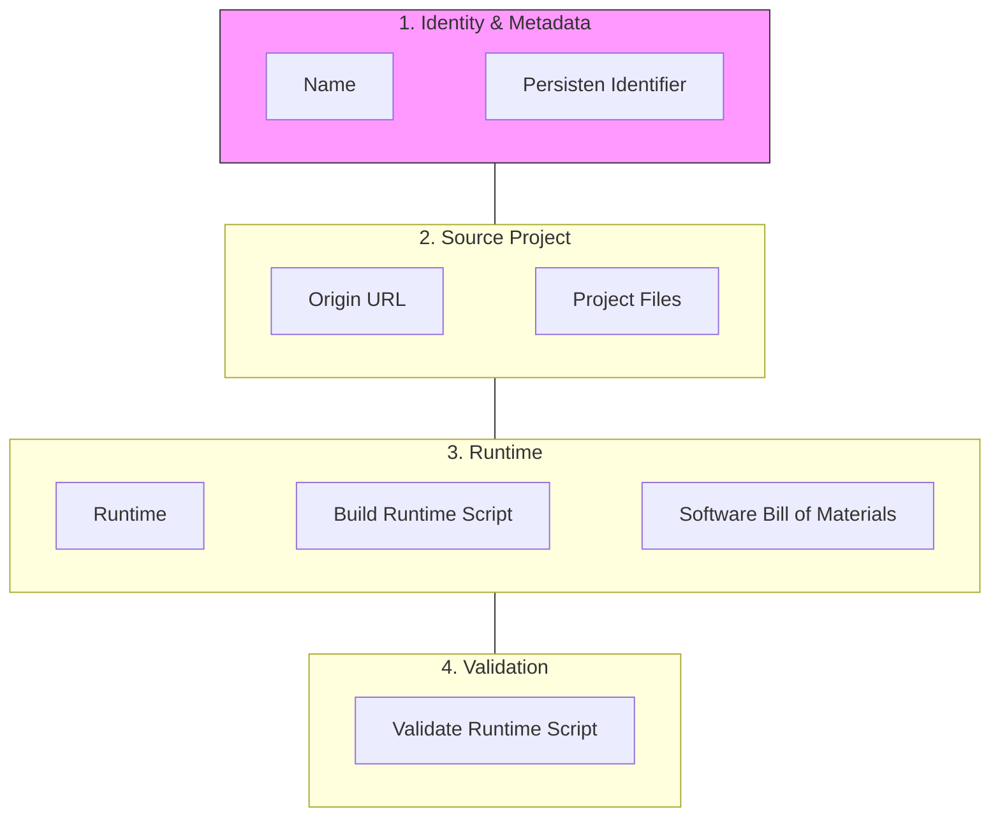

--- 
theme: seriph
title: Reproducibility in Scientific Software Repositories and the Reusable Execution Environment
author: Vu, Blessing, Dragoljic, Goedicke
layout: center
info: |
  ## Slidev Starter Template
  Presentation slides for developers.

  Learn more at [Sli.dev](https://sli.dev)
# apply UnoCSS classes to the current slide
class: text-center
# https://sli.dev/features/drawing
drawings:
  persist: false
# slide transition: https://sli.dev/guide/animations.html#slide-transitions
transition: slide-left
# enable MDC Syntax: https://sli.dev/features/mdc
mdc: true
# duration of the presentation
duration: 35min
---

# Reproducibility in Scientific Software Repositories and the Reusable Execution Environment 

Anh Duc Vu, Christoph Blessing, Ana Dragoljic, Michael Goedicke

<!--
Welcome everyone. Today I want to talk about a problem that sits at the intersection of software engineering and scientific methodology — the reproducibility crisis in research software.

The premise is simple and somewhat uncomfortable: having access to the source code of a scientific experiment is often not enough to actually re-run it. We'll look at why that is, how widespread the problem is, and what the landscape looks like in practice.
-->

---

# "Works on My Machine"
### Code is Not Enough

<div class="flex flex-col h-full gap-4">

<p class="text-sm text-gray-400 italic">You have the code. But can you actually run it?</p>

<div class="grid grid-cols-3 gap-4 mt-2">

<div class="border border-red-400 rounded-lg p-4">
  <h3 class="font-bold text-red-400 mb-1">Software Decay</h3>
  <p class="text-sm">Code that worked at publication often fails 6 months later due to <strong>bit rot</strong> — silent breakage as the ecosystem evolves underneath it.</p>
</div>

<div class="border border-yellow-400 rounded-lg p-4">
  <h3 class="font-bold text-yellow-400 mb-1">The Missing Environment</h3>
  <p class="text-sm">Papers document the <strong>math</strong>, rarely the <strong>environment</strong> — OS version, compiler flags, shared libraries, and runtime configuration are invisible.</p>
</div>

<div class="border border-orange-400 rounded-lg p-4">
  <h3 class="font-bold text-orange-400 mb-1">Numerical Non-Determinism</h3>
  <p class="text-sm">Small changes in C-libraries like <code>glibc</code> or <code>MKL</code> can lead to <strong>divergent scientific conclusions</strong> from identical source code.</p>
</div>

</div>

<blockquote class="border-l-4 border-blue-400 pl-4 mt-2 text-sm text-gray-300">
  "A scientific publication is not the scholarship itself, it is merely the <strong>advertising</strong> of the scholarship. The actual scholarship is the complete software environment and data which produced the figures."
  <br/><span class="text-gray-500 text-xs">— Buckheit & Donoho (1995)</span>
</blockquote>

</div>

<!--
So what do we actually mean by "works on my machine"? Every developer has heard this phrase — it's almost a joke. But in research software it stops being funny, because there is no shared machine, no shared environment, and often no way to recreate one.

There are three core failure modes. The first is software decay — also called bit rot. A codebase doesn't change, but the world around it does. Libraries release breaking changes, APIs are deprecated, Python versions move on. Code that ran perfectly at submission time may be completely broken six months later, with no changes to the repository itself.

The second is the missing environment. A scientific paper will carefully document every equation, every hyperparameter, every architectural choice — but say nothing about the OS version, the compiler, or which version of BLAS was linked against. That information lives implicitly in the author's machine and almost never makes it into the paper or the repository.

The third is numerical non-determinism. This one is subtle and particularly dangerous. Changing the underlying C library — say, switching from one version of glibc or MKL to another — can change floating point behaviour in ways that silently alter results. Same code, different numbers, potentially different scientific conclusions.

The quote at the bottom is from 1995 and it still feels radical today. Buckheit and Donoho are essentially saying that the paper is just the trailer — the real artifact is the software environment. We are a long way from treating it that way.
-->


---

# How Bad Is It? The Numbers

<div class="flex flex-col h-full gap-5 mt-2">

<div class="grid grid-cols-3 gap-4">

<div class="bg-gray-800 rounded-lg p-4 text-center">
  <div class="text-4xl font-bold text-red-400">70%</div>
  <p class="text-sm mt-1">of 1,576 researchers <strong>failed to reproduce</strong> a published result</p>
  <p class="text-xs text-gray-500 mt-2">Nature survey — Baker 2016</p>
</div>

<div class="bg-gray-800 rounded-lg p-4 text-center">
  <div class="text-4xl font-bold text-orange-400">58%</div>
  <p class="text-sm mt-1">of CS graduate students reported <strong>replication difficulties</strong></p>
  <p class="text-xs text-gray-500 mt-2">Cacho 2020</p>
</div>

<div class="bg-gray-800 rounded-lg p-4 text-center">
  <div class="text-4xl font-bold text-yellow-400">6%</div>
  <p class="text-sm mt-1">of 400 studied AI papers <strong>included source code</strong> at all</p>
  <p class="text-xs text-gray-500 mt-2">Hutson 2018</p>
</div>

</div>

<div class="border border-gray-600 rounded-lg p-4 text-sm">
  <h3 class="font-bold mb-2 text-gray-300">📓 Jupyter Notebooks — A Case Study</h3>
  <div class="grid grid-cols-2 gap-6">
    <div>
      <p>Only <strong class="text-red-400">13.7%</strong> of notebooks declared their dependencies — and of those, installation failure rates were <strong class="text-red-400">61–67%</strong>.</p>
      <p class="text-gray-500 text-xs mt-1">Pimentel et al., MSR 2019</p>
    </div>
    <div>
      <p><strong class="text-red-400">87.6%</strong> of biomedical Jupyter notebooks resulted in exceptions when re-executed — <code>ModuleNotFoundError</code>, <code>FileNotFoundError</code>, <code>ImportError</code>.</p>
      <p class="text-gray-500 text-xs mt-1">Samuel & Mietchen, GigaScience 2024</p>
    </div>
  </div>
</div>

</div>

<!--
This is not a theoretical concern — the data is quite damning.

A Nature survey of over 1,500 researchers found that more than 70% had failed to reproduce someone else's published result. More than half had failed to reproduce their own. This is across disciplines, not just CS.

Within computer science specifically, Cacho found that 58% of graduate students reported difficulties replicating results — and these are people with strong technical backgrounds, working in their own field.

The AI number is perhaps the most striking: in 2018, Hutson found that only 6% of studied AI papers included source code. The majority of results being published were not even theoretically reproducible — there was simply nothing to run.

The Jupyter notebook studies are a useful concrete case because notebooks are supposed to be the gold standard of shareable, executable research. And yet — less than 14% declared their dependencies at all. And even when they did, installation failed more than 60% of the time. The biomedical study re-executed thousands of notebooks and found that nearly 9 in 10 crashed immediately with import or file errors.

The pattern is consistent across years, venues, and fields: reproducibility is treated as an afterthought, if it is considered at all.
-->

---

# Defining the Spectrum
Reproducibility is a technical challenge, not just a social one.


| Term | Data | Code | Goal |
| :--- | :--- | :--- | :--- |
| **Reproducible** | Same | Same | Recreate the exact same results. |
| **Replicable** | New | Same | See if findings hold in new contexts. |
| **Robust** | Same | New | Ensure findings aren't artifacts of one tool. |

<br>

### Our Focus: **Computational Reproducibility**
Controlling the **runtime environment** to ensure that "Same Code" actually behaves as "Same Code" across different machines and years.

---
layout: default
---

# Reproducibility Levels

<div class="grid grid-cols-2 gap-x-6 gap-y-4 text-[11px] leading-tight">

<!-- Level 1 -->
<div v-click="1" class="border-l-4 border-red-500 p-2 bg-red-50 dark:bg-red-900/10">
  <strong>Level 1: Natural Language description only, for example in a README file.</strong>
  <div class="grid grid-cols-3 gap-2 mt-1">
    <code class="opacity-70">"This project requires python 3.10 and numpy."</code>
    <span class="text-red-600">❌ Problem: Human error; "latest" version changes daily.</span>
    <span class="text-green-600">✅ Improvement: Create a formal dependency file allowing programmatic installation.</span>
  </div>
</div>

<!-- Level 2 -->
<div v-click="2" class="border-l-4 border-orange-500 p-2 bg-orange-50 dark:bg-orange-900/10">
  <strong>Level 2: Dependencies are declared in a manifest file, for example requirements.txt.</strong>
  <div class="grid grid-cols-3 gap-2 mt-1">
    <code class="opacity-70">requirements.txt: <br>pandas</code>
    <span class="text-red-600">❌ Problem: Installs different versions on different days.</span>
    <span class="text-green-600">✅ Improvement: Pin the required versions of each dependency (<code>pandas==2.1.0</code>).</span>
  </div>
</div>

<!-- Level 3 -->
<div v-click="3" class="border-l-4 border-yellow-500 p-2 bg-yellow-50 dark:bg-yellow-900/10">
  <strong>Level 3: Versions of Top-Level dependencies are specified.</strong>
  <div class="grid grid-cols-3 gap-2 mt-1">
    <code class="opacity-70">pandas==2.1.0</code>
    <span class="text-red-600">❌ Problem: Versions of not declared transitive dependencies are not specified.</span>
    <span class="text-green-600">✅ Improvement: Use a <strong>Lockfile</strong> (<code>poetry.lock</code>).</span>
  </div>
</div>

<!-- Level 4 -->
<div v-click="5" class="border-l-4 border-blue-500 p-2 bg-blue-50 dark:bg-blue-900/10">
  <strong>Level 4: Dependencies are "locked".</strong>
  <div class="grid grid-cols-3 gap-2 mt-1">
    <code class="opacity-70">poetry.lock</code>
    <span class="text-red-600">❌ Problem: Language specific lock files do not include system dependencies (libblas, glibc, CUDA).</span>
    <span class="text-green-600">✅ Improvement: Add <strong>Containers</strong> or <strong>VMs</strong> to package OS and system libraries.</span>
  </div>
</div>

<!-- Level 5 -->
<div v-click="6" class="border-l-4 border-green-500 p-2 bg-green-50 dark:bg-green-900/10">
  <strong>Level 5: Container environments like Docker.</strong>
  <div class="grid grid-cols-3 gap-2 mt-1">
    <code class="opacity-70">FROM python:3.9</code>
    <span class="text-red-600">❌ Problem: Base image and apt-get are non-deterministic.</span>
    <span class="text-green-600">✅ Improvement: Functional declarative system environment specifications for example with <strong>nix</strong>.</span>
  </div>
</div>

<!-- Level 6 -->
<div v-click="8" class="border-l-4 border-green-500 p-2 bg-green-50 dark:bg-green-900/10">
  <strong>Level 6: Declarative System Environment Specification for example with nix.</strong>
  <div class="grid grid-cols-3 gap-2 mt-1">
    <code class="opacity-70">buildInputs = [
            pythonEnv
            pkgs.git
            pkgs.zlib
          ];</code>
    <span class="text-red-600">❌ Problem: Availability of source code of the various packages</span>
    <span class="text-green-600">✅ Improvement: Long time archives like <strong>Software Heritage Foundation</strong>.</span>
  </div>
</div>

</div>

<!-- SCREEN OVERLAYS FOR DETAILS-->
<div v-if="$clicks===4 || $clicks===7 || $clicks===9" 
     class="absolute inset-0 m-auto w-[90%] h-[88%] z-50 p-8 shadow-2xl rounded-xl border-t-8 flex flex-col items-center justify-center bg-white dark:bg-gray-800"
     :class="{
       'border-yellow-500': $clicks === 4,
       'border-green-500': $clicks === 7,
       'border-green-600': $clicks === 9
     }">

  <!-- Content for Level 3 -->
  <div v-if="$clicks === 4" class="grid grid-cols-2 gap-4">

  <div>
  requirements.txt
```python
  django==6.0.2
  numpy==2.4.2
  pandas==3.0.1
  pipdeptree==2.31.0
```
  pipdeptree
```yaml
  Django==6.0.2
  ├── asgiref [required: >=3.9.1, installed: 3.11.1]
  └── sqlparse [required: >=0.5.0, installed: 0.5.5]
  pandas==3.0.1
  ├── numpy [required: >=1.26.0, installed: 2.4.2]
  └── python-dateutil [required: >=2.8.2, installed: 2.9.0.post0]
    └── six [required: >=1.5, installed: 1.17.0]
  pipdeptree==2.31.0
  ├── packaging [required: >=26, installed: 26.0]
  └── pip [required: >=25.2, installed: 26.0.1]
```
  </div>

  <div>
  uv.lock
```toml
  [[package]]
  name = "asgiref"
  version = "3.11.1"
  source = { registry = "https://pypi.org/simple" }
  sdist = { url = "https://files.pythonhosted.org/packages/63/40/f03da1264ae8f7cfdbf9146542e5e7e8100a4c66ab48e791df9a03d3f6c0/asgiref-3.11.1.tar.gz", hash = "sha256:5f184dc43b7e763efe848065441eac62229c9f7b0475f41f80e207a114eda4ce", size = 38550 }
  wheels = [
    { url = "https://files.pythonhosted.org/packages/5c/0a/a72d10ed65068e115044937873362e6e32fab1b7dce0046aeb224682c989/asgiref-3.11.1-py3-none-any.whl", hash = "sha256:e8667a091e69529631969fd45dc268fa79b99c92c5fcdda727757e52146ec133", size = 24345 },
  ]

  [[package]]
  name = "django"
  version = "6.0.2"
  source = { registry = "https://pypi.org/simple" }
  dependencies = [
    { name = "asgiref" },
    { name = "sqlparse" },
    { name = "tzdata", marker = "sys_platform == 'win32'" },
  ]
  sdist = { url = "https://files.pythonhosted.org/packages/26/3e/a1c4207c5dea4697b7a3387e26584919ba987d8f9320f59dc0b5c557a4eb/django-6.0.2.tar.gz", hash = "sha256:3046a53b0e40d4b676c3b774c73411d7184ae2745fe8ce5e45c0f33d3ddb71a7", size = 10886874 }
  wheels = [
    { url = "https://files.pythonhosted.org/packages/96/ba/a6e2992bc5b8c688249c00ea48cb1b7a9bc09839328c81dc603671460928/django-6.0.2-py3-none-any.whl", hash = "sha256:610dd3b13d15ec3f1e1d257caedd751db8033c5ad8ea0e2d1219a8acf446ecc6", size = 8339381 },
  ]
```
</div>
  </div>
  
  <!-- Content for Level 5 -->
  <div v-if="$clicks === 7">
  
  # Dockerfiles are not perfect

### The Problematic Dockerfile

```dockerfile
FROM python:3.9                                         # ❌ Moves every time Python updates
RUN apt-get update && apt-get install -y libblas-dev    # ❌ Fetches latest binary from Debian
COPY . .
RUN pip install pandas==2.1.0                           # ❌ No lockfile; transitive deps float
```

### Improved Dockerfile
```dockerfile
FROM python:3.9.18@sha256:c3b1...                       # ✅ Immutable base
RUN apt-get update && apt-get install -y \
    libblas-dev=3.11.0                                  # ✅ Pinned dependencies
COPY poetry.lock pyproject.toml ./
RUN poetry install --no-root                            # ✅ Python dependencies from lock file
```


--> Working with Dockerfiles requires careful attention to make reproducible

  </div>
  
  <!-- Content for Level 5 -->
  <div v-if="$clicks === 9" class="grid grid-cols-2 gap-4">
  <div>
```nix
{
  inputs = {
    nixpkgs.url = "github:NixOS/nixpkgs/nixos-unstable";
    flake-utils.url = "github:numtide/flake-utils";
  };
  outputs = { self, nixpkgs, flake-utils }:
    flake-utils.lib.eachDefaultSystem (system:
      let
        pkgs = import nixpkgs {
          inherit system;
        };
      in
      {
        devShells.default = pkgs.mkShell {
          buildInputs = with pkgs; [
            git
            docker-client
            nodejs_25        
            python313Packages.uv
            kubectl
          ];
        };
      });
}
```
  </div>

  <div class="flex flex-col justify-center space-y-3 text-sm">

  ### Declarative System Environment with Nix
  **Nix** is a purely functional package manager and build system. Instead of mutating global state, every package lives in its own isolated path in `/nix/store`.

  ### ✅ Advantages
  - **Reproducible** — the same flake produces bit-for-bit identical environments on any machine
  - **Declarative** — your entire dev environment is code, version-controlled alongside your project
  - **No conflicts** — multiple versions of the same tool coexist without clashing
  - **Cross-platform** — `eachDefaultSystem` handles Linux & macOS automatically
  - **Zero setup drift** — new team members run `nix develop` and get the exact same shell instantly

  </div>

  </div>

</div>


<!-- Level 6 -->
<div v-click="10" class="mt-4 border-l-4 border-green-500 p-2 bg-green-50 dark:bg-green-900/10">
  <strong>Beyond: Long time archive of packages + Hardware environment.</strong>
  <div class="grid grid-cols-3 gap-2 mt-1">
    Also the matter of environment vars and sources of non determinism like random number seeds.
  </div>
</div>

---

# Dependency Management in Scientific Software Github Repositories

<div class="flex flex-col h-full gap-2">

<div class="text-sm leading-relaxed">

- Conducted a **GitHub search** spanning **2020–2025** for research software projects
- Targeted Python repositories from popular CS conferences: **ICSE, ICML, NeurIPS, ASE**, and others
- Retrieved using the query `conf_name + year + language:python`

</div>

<div class="flex flex-row flex-1 gap-6 items-start justify-center mt-2">
  
  
</div>

</div>


<!--
To understand the state of reproducibility in scientific software, we searched GitHub for Python repositories linked to papers from major CS conferences between 2020 and 2025.

The left chart shows that a surprisingly high share of these repos have either undeclared or unpinned dependencies. Undeclared means there is no dependency specification at all — no requirements.txt, no pyproject.toml, nothing. Unpinned means dependencies are listed but without version constraints, so anyone running the code tomorrow may get a completely different version of a library than the one the authors used. Both cases make it essentially impossible to guarantee the same execution environment.

The right chart is even more telling — virtually no repositories use lockfiles or Dockerfiles. These are the two most accessible tools for guaranteeing a reproducible environment. A lockfile freezes the exact resolved versions of every dependency in the tree. A Dockerfile packages the entire runtime. The near-zero adoption across thousands of repos from top-tier venues is a striking result.

What is perhaps most interesting is that this is not a niche or obscure set of repositories — these are codebases associated with peer-reviewed papers at ICSE, ICML, NeurIPS, ASE, and similar venues. These are researchers who presumably care about scientific rigour, yet the software artifacts they publish are largely not reproducibly executable.

We can also break these numbers down per conference and per year — which reveals whether certain venues or time periods are better or worse, and whether the situation has improved at all over the five years we studied. Spoiler: the trend is not particularly encouraging.

The takeaway from these charts is simple: dependency mismanagement is the norm, not the exception, in scientific software — and that has direct consequences for the reproducibility of scientific results.
-->


---

# NFDIxCS

<div class="grid grid-cols-2 gap-8 mt-4">

<div class="flex flex-col justify-center space-y-3">

**Central object: Research Data Management Containers (RDMC)** — time capsules for research data and software

- 📦 Bundles software, data, and metadata
- 🔍 FAIR by design – metadata is openly available
- 🔒 Manages access and workflows
- 🗄️ Container will be archived

</div>

<div class="flex items-center justify-center">
  
</div>

</div>

---

# Reusable Execution Environment (REE)


---
layout: two-cols
---

# Modeling a Reusable Execution Environment


::right::
ads

::left::



---

# REE service

