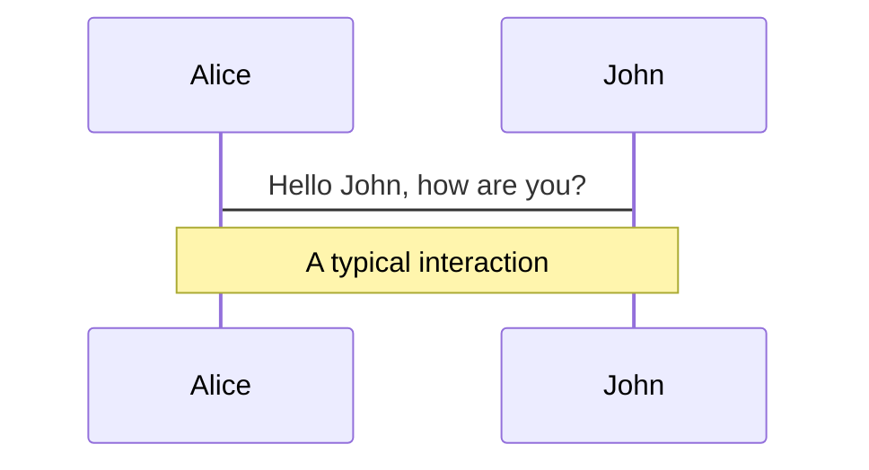
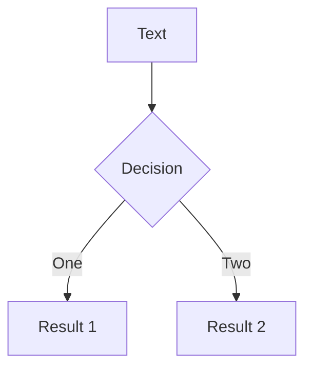
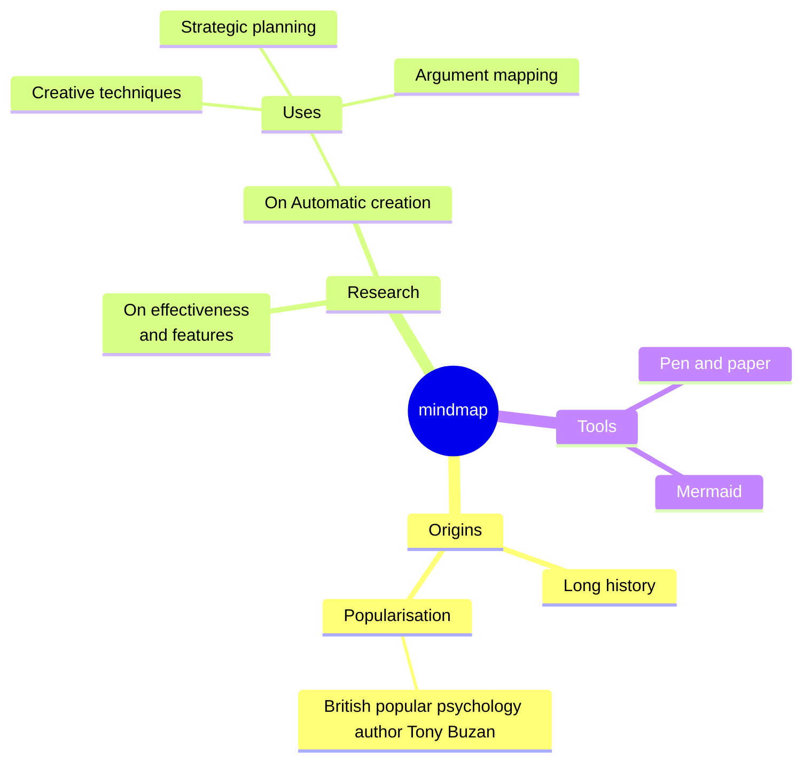
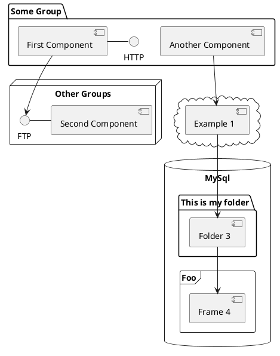
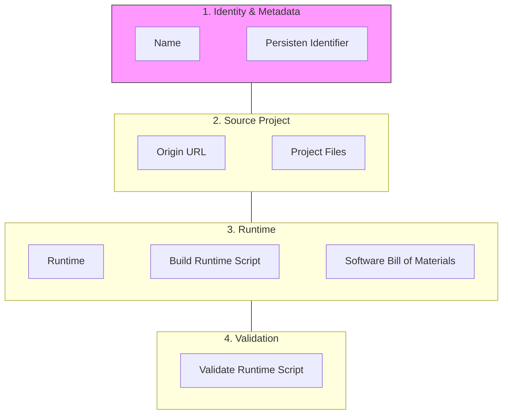

---
# try also 'default' to start simple
theme: seriph
# random image from a curated Unsplash collection by Anthony
# like them? see https://unsplash.com/collections/94734566/slidev
background: https://cover.sli.dev
# some information about your slides (markdown enabled)
title: Reproducibility in Scientific Software Repositories and the Reusable Execution Environment
author: Vu, Blessing, Goedicke
info: |
  ## Slidev Starter Template
  Presentation slides for developers.

  Learn more at [Sli.dev](https://sli.dev)
# apply UnoCSS classes to the current slide
class: text-center
# https://sli.dev/features/drawing
drawings:
  persist: false
# slide transition: https://sli.dev/guide/animations.html#slide-transitions
transition: slide-left
# enable MDC Syntax: https://sli.dev/features/mdc
mdc: true
# duration of the presentation
duration: 35min
---

# Welcome to Slidev

Presentation slides for developers

<div @click="$slidev.nav.next" class="mt-12 py-1" hover:bg="white op-10">
  Press Space for next page <carbon:arrow-right />
</div>

<div class="abs-br m-6 text-xl">
  <button @click="$slidev.nav.openInEditor()" title="Open in Editor" class="slidev-icon-btn">
    <carbon:edit />
  </button>
  <a href="https://github.com/slidevjs/slidev" target="_blank" class="slidev-icon-btn">
    <carbon:logo-github />
  </a>
</div>

<!--
The last comment block of each slide will be treated as slide notes. It will be visible and editable in Presenter Mode along with the slide. [Read more in the docs](https://sli.dev/guide/syntax.html#notes)
-->

---
transition: fade-out
---

# What is Slidev?

Slidev is a slides maker and presenter designed for developers, consist of the following features

- 📝 **Text-based** - focus on the content with Markdown, and then style them later
- 🎨 **Themable** - themes can be shared and re-used as npm packages
- 🧑‍💻 **Developer Friendly** - code highlighting, live coding with autocompletion
- 🤹 **Interactive** - embed Vue components to enhance your expressions
- 🎥 **Recording** - built-in recording and camera view
- 📤 **Portable** - export to PDF, PPTX, PNGs, or even a hostable SPA
- 🛠 **Hackable** - virtually anything that's possible on a webpage is possible in Slidev
<br>
<br>

Read more about [Why Slidev?](https://sli.dev/guide/why)

<!--
You can have `style` tag in markdown to override the style for the current page.
Learn more: https://sli.dev/features/slide-scope-style
-->

<style>
h1 {
  background-color: #2B90B6;
  background-image: linear-gradient(45deg, #4EC5D4 10%, #146b8c 20%);
  background-size: 100%;
  -webkit-background-clip: text;
  -moz-background-clip: text;
  -webkit-text-fill-color: transparent;
  -moz-text-fill-color: transparent;
}
</style>

<!--
Here is another comment.
-->

---
transition: slide-up
level: 2
---

# Navigation

Hover on the bottom-left corner to see the navigation's controls panel, [learn more](https://sli.dev/guide/ui#navigation-bar)

## Keyboard Shortcuts

|                                                     |                             |
| --------------------------------------------------- | --------------------------- |
| <kbd>right</kbd> / <kbd>space</kbd>                 | next animation or slide     |
| <kbd>left</kbd>  / <kbd>shift</kbd><kbd>space</kbd> | previous animation or slide |
| <kbd>up</kbd>                                       | previous slide              |
| <kbd>down</kbd>                                     | next slide                  |

<!-- https://sli.dev/guide/animations.html#click-animation -->

<p v-after class="absolute bottom-23 left-45 opacity-30 transform -rotate-10">Here!</p>

---
layout: two-cols
layoutClass: gap-16
---

# Table of contents

You can use the `Toc` component to generate a table of contents for your slides:

```html
<Toc minDepth="1" maxDepth="1" />
```

The title will be inferred from your slide content, or you can override it with `title` and `level` in your frontmatter.

::right::

<Toc text-sm minDepth="1" maxDepth="2" />

---
layout: image-right
image: https://cover.sli.dev
---

# Code

Use code snippets and get the highlighting directly, and even types hover!

```ts [filename-example.ts] {all|4|6|6-7|9|all} twoslash
// TwoSlash enables TypeScript hover information
// and errors in markdown code blocks
// More at https://shiki.style/packages/twoslash
import { computed, ref } from 'vue'

const count = ref(0)
const doubled = computed(() => count.value * 2)

doubled.value = 2
```

<arrow v-click="[4, 5]" x1="350" y1="310" x2="195" y2="342" color="#953" width="2" arrowSize="1" />

<!-- This allow you to embed external code blocks -->
<<< @/snippets/external.ts#snippet

<!-- Footer -->

[Learn more](https://sli.dev/features/line-highlighting)

<!-- Inline style -->
<style>
.footnotes-sep {
  @apply mt-5 opacity-10;
}
.footnotes {
  @apply text-sm opacity-75;
}
.footnote-backref {
  display: none;
}
</style>

<!--
Notes can also sync with clicks

[click] This will be highlighted after the first click

[click] Highlighted with `count = ref(0)`

[click:3] Last click (skip two clicks)
-->

---
level: 2
---

# Shiki Magic Move

Powered by [shiki-magic-move](https://shiki-magic-move.netlify.app/), Slidev supports animations across multiple code snippets.

Add multiple code blocks and wrap them with <code>````md magic-move</code> (four backticks) to enable the magic move. For example:

````md magic-move {lines: true}
```ts {*|2|*}
// step 1
const author = reactive({
  name: 'John Doe',
  books: [
    'Vue 2 - Advanced Guide',
    'Vue 3 - Basic Guide',
    'Vue 4 - The Mystery'
  ]
})
```

```ts {*|1-2|3-4|3-4,8}
// step 2
export default {
  data() {
    return {
      author: {
        name: 'John Doe',
        books: [
          'Vue 2 - Advanced Guide',
          'Vue 3 - Basic Guide',
          'Vue 4 - The Mystery'
        ]
      }
    }
  }
}
```

```ts
// step 3
export default {
  data: () => ({
    author: {
      name: 'John Doe',
      books: [
        'Vue 2 - Advanced Guide',
        'Vue 3 - Basic Guide',
        'Vue 4 - The Mystery'
      ]
    }
  })
}
```

Non-code blocks are ignored.

```vue
<!-- step 4 -->
<script setup>
const author = {
  name: 'John Doe',
  books: [
    'Vue 2 - Advanced Guide',
    'Vue 3 - Basic Guide',
    'Vue 4 - The Mystery'
  ]
}
</script>
```
````

---

# Components

<div grid="~ cols-2 gap-4">
<div>

You can use Vue components directly inside your slides.

We have provided a few built-in components like `<Tweet/>` and `<Youtube/>` that you can use directly. And adding your custom components is also super easy.

```html
<Counter :count="10" />
```

<!-- ./components/Counter.vue -->
<Counter :count="10" m="t-4" />

Check out [the guides](https://sli.dev/builtin/components.html) for more.

</div>
<div>

```html
<Tweet id="1390115482657726468" />
```

<Tweet id="1390115482657726468" scale="0.65" />

</div>
</div>

<!--
Presenter note with **bold**, *italic*, and ~~striked~~ text.

Also, HTML elements are valid:
<div class="flex w-full">
  <span style="flex-grow: 1;">Left content</span>
  <span>Right content</span>
</div>
-->

---
class: px-20
---

# Themes

Slidev comes with powerful theming support. Themes can provide styles, layouts, components, or even configurations for tools. Switching between themes by just **one edit** in your frontmatter:

<div grid="~ cols-2 gap-2" m="t-2">

```yaml
---
theme: default
---
```

```yaml
---
theme: seriph
---
```


</div>

Read more about [How to use a theme](https://sli.dev/guide/theme-addon#use-theme) and
check out the [Awesome Themes Gallery](https://sli.dev/resources/theme-gallery).

---

# Clicks Animations

You can add `v-click` to elements to add a click animation.

<div v-click>

This shows up when you click the slide:

```html
<div v-click>This shows up when you click the slide.</div>
```

</div>

<br>

<v-click>

The <span v-mark.red="3"><code>v-mark</code> directive</span>
also allows you to add
<span v-mark.circle.orange="4">inline marks</span>
, powered by [Rough Notation](https://roughnotation.com/):

```html
<span v-mark.underline.orange>inline markers</span>
```

</v-click>

<div mt-20 v-click>

[Learn more](https://sli.dev/guide/animations#click-animation)

</div>

---

# Motions

Motion animations are powered by [@vueuse/motion](https://motion.vueuse.org/), triggered by `v-motion` directive.

```html
<div
  v-motion
  :initial="{ x: -80 }"
  :enter="{ x: 0 }"
  :click-3="{ x: 80 }"
  :leave="{ x: 1000 }"
>
  Slidev
</div>
```

<div class="w-60 relative">
  <div class="relative w-40 h-40">
    
    
    
  </div>

  <div
    class="text-5xl absolute top-14 left-40 text-[#2B90B6] -z-1"
    v-motion
    :initial="{ x: -80, opacity: 0}"
    :enter="{ x: 0, opacity: 1, transition: { delay: 2000, duration: 1000 } }">
    Slidev
  </div>
</div>

<!-- vue script setup scripts can be directly used in markdown, and will only affects current page -->
<script setup lang="ts">
const final = {
  x: 0,
  y: 0,
  rotate: 0,
  scale: 1,
  transition: {
    type: 'spring',
    damping: 10,
    stiffness: 20,
    mass: 2
  }
}
</script>

<div
  v-motion
  :initial="{ x:35, y: 30, opacity: 0}"
  :enter="{ y: 0, opacity: 1, transition: { delay: 3500 } }">

[Learn more](https://sli.dev/guide/animations.html#motion)

</div>

---

# $\LaTeX$

$\LaTeX$ is supported out-of-box. Powered by [$\KaTeX$](https://katex.org/).

<div h-3 />

Inline $\sqrt{3x-1}+(1+x)^2$

Block
$$ {1|3|all}
\begin{aligned}
\nabla \cdot \vec{E} &= \frac{\rho}{\varepsilon_0} \\
\nabla \cdot \vec{B} &= 0 \\
\nabla \times \vec{E} &= -\frac{\partial\vec{B}}{\partial t} \\
\nabla \times \vec{B} &= \mu_0\vec{J} + \mu_0\varepsilon_0\frac{\partial\vec{E}}{\partial t}
\end{aligned}
$$

[Learn more](https://sli.dev/features/latex)

---

# Diagrams

You can create diagrams / graphs from textual descriptions, directly in your Markdown.

<div class="grid grid-cols-4 gap-5 pt-4 -mb-6">









</div>

Learn more: [Mermaid Diagrams](https://sli.dev/features/mermaid) and [PlantUML Diagrams](https://sli.dev/features/plantuml)

---
foo: bar
dragPos:
  square: 672,12,167,_,-16
---

# Draggable Elements

Double-click on the draggable elements to edit their positions.

<br>

###### Directive Usage

```md

```

<br>

###### Component Usage

```md
<v-drag text-3xl>
  <div class="i-carbon:arrow-up" />
  Use the `v-drag` component to have a draggable container!
</v-drag>
```

<v-drag pos="671,177,261,_,-15">
  <div text-center text-3xl border border-main rounded>
    Double-click me!
  </div>
</v-drag>


###### Draggable Arrow

```md
<v-drag-arrow two-way />
```

<v-drag-arrow pos="67,452,253,46" two-way op70 />

---
src: ./pages/imported-slides.md
hide: false
---

---

# Monaco Editor

Slidev provides built-in Monaco Editor support.

Add `{monaco}` to the code block to turn it into an editor:

```ts {monaco}
import { ref } from 'vue'
import { emptyArray } from './external'

const arr = ref(emptyArray(10))
```

Use `{monaco-run}` to create an editor that can execute the code directly in the slide:

```ts {monaco-run}
import { version } from 'vue'
import { emptyArray, sayHello } from './external'

sayHello()
console.log(`vue ${version}`)
console.log(emptyArray<number>(10).reduce(fib => [...fib, fib.at(-1)! + fib.at(-2)!], [1, 1]))
```

---
layout: center
class: text-center
---

# Learn More

[Documentation](https://sli.dev) · [GitHub](https://github.com/slidevjs/slidev) · [Showcases](https://sli.dev/resources/showcases)

<PoweredBySlidev mt-10 />

--- 
layout: center
---

# Reproducibility in Scientific Software Repositories and the Reusable Execution Environment 

Anh Duc Vu, Christoph Blessing, Michael Goedicke

---

# Problem Formulation: The "In-Silico" Gap
Despite having the code, we often cannot run it.

*   **The Decay of Software:** Code that worked during publication often fails 6 months later due to "bit rot."
*   **The Hidden State:** Research papers often document the *math*, but rarely the *environment* (OS version, compiler flags, shared libraries).
*   **Numerical Non-Determinism:** Small changes in underlying C-libraries (e.g., `glibc` or `MKL`) can lead to divergent scientific conclusions.

> "A scientific publication is not the scholarship itself, it is merely the **advertising** of the scholarship. The actual scholarship is the complete software environment and data which produced the figures." 
> — *Buckheit & Donoho (1995)*


---

# The difficulty to reproduce Computer Science Research

## 'Works on my Machine'

  - Survey from Nature with 1,576 researchers: > 70 % failed on reproducibility, > 50 % failed on repeatability \[Baker 2016\]
  - 58 % of asked graduate students reported difficulties in replication in CS [Cacho 2020]
  - Issues in AI (e.g., 6 % of 400 studied AI papers included source code) [Hutson 2018]

---

 - "118,483 (13.72%) declared dependencies"

 - "To install the dependencies, we first installed all the setup.py files in the repository. Then,we installed the requirements.txt files. Finally, we installed the Pipfile files. The failure rate for these files were 67.55%, 61.17%, and 65.20%, respectively."

Pimentel, João Felipe, et al. "A large-scale study about quality and reproducibility of jupyter notebooks." 2019 IEEE/ACM 16th international conference on mining software repositories (MSR) 
 
 
 - "dependencies of 5,429 (34.32%) notebooks failed to install"

 - "9,100 (87.6%) notebooks resulted in exceptions, for a variety of reasons. ModuleNotFoundError, FileNotFoundError, and ImportError are the most common exceptions we observed in the notebooks"

Samuel, Sheeba, and Daniel Mietchen. "Computational reproducibility of Jupyter notebooks from biomedical publications." GigaScience 13 (2024)

---

# Root Causes: The "Dependency Hell"

---

# Defining the Spectrum
Reproducibility is a technical challenge, not just a social one.


| Term | Data | Code | Goal |
| :--- | :--- | :--- | :--- |
| **Reproducible** | Same | Same | Recreate the exact same results. |
| **Replicable** | New | Same | See if findings hold in new contexts. |
| **Robust** | Same | New | Ensure findings aren't artifacts of one tool. |

<br>

### Our Focus: **Computational Reproducibility**
Controlling the **runtime environment** to ensure that "Same Code" actually behaves as "Same Code" across different machines and years.

---
layout: default
---

# Reproducibility Levels

<div class="grid grid-cols-2 gap-x-6 gap-y-4 text-[11px] leading-tight">

<!-- Level 1 -->
<div v-click="1" class="border-l-4 border-red-500 p-2 bg-red-50 dark:bg-red-900/10">
  <strong>Level 1: Natural Language description only, for example in a README file.</strong>
  <div class="grid grid-cols-3 gap-2 mt-1">
    <code class="opacity-70">"This project requires python 3.10 and numpy."</code>
    <span class="text-red-600">❌ Problem: Human error; "latest" version changes daily.</span>
    <span class="text-green-600">✅ Improvement: Create a formal dependency file allowing programmatic installation.</span>
  </div>
</div>

<!-- Level 2 -->
<div v-click="3" class="border-l-4 border-orange-500 p-2 bg-orange-50 dark:bg-orange-900/10">
  <strong>Level 2: Dependencies are declared in a manifest file, for example requirements.txt.</strong>
  <div class="grid grid-cols-3 gap-2 mt-1">
    <code class="opacity-70">requirements.txt: <br>pandas</code>
    <span class="text-red-600">❌ Problem: Installs different versions on different days.</span>
    <span class="text-green-600">✅ Improvement: Pin the required versions of each dependency (<code>pandas==2.1.0</code>).</span>
  </div>
</div>

<!-- Level 3 -->
<div v-click="5" class="border-l-4 border-yellow-500 p-2 bg-yellow-50 dark:bg-yellow-900/10">
  <strong>Level 3: Versions of Top-Level dependencies are specified.</strong>
  <div class="grid grid-cols-3 gap-2 mt-1">
    <code class="opacity-70">pandas==2.1.0</code>
    <span class="text-red-600">❌ Problem: Versions of not declared transitive dependencies are not specified.</span>
    <span class="text-green-600">✅ Improvement: Use a <strong>Lockfile</strong> (<code>poetry.lock</code>).</span>
  </div>
</div>

<!-- Level 4 -->
<div v-click="7" class="border-l-4 border-blue-500 p-2 bg-blue-50 dark:bg-blue-900/10">
  <strong>Level 4: Dependencies are "locked".</strong>
  <div class="grid grid-cols-3 gap-2 mt-1">
    <code class="opacity-70">poetry.lock</code>
    <span class="text-red-600">❌ Problem: Language specific lock files do not include system dependencies (libblas, glibc, CUDA).</span>
    <span class="text-green-600">✅ Improvement: Add <strong>Containers</strong> or <strong>VMs</strong> to package OS and system libraries.</span>
  </div>
</div>

<!-- Level 5 -->
<div v-click="9" class="border-l-4 border-green-500 p-2 bg-green-50 dark:bg-green-900/10">
  <strong>Level 5: Container environments like Docker.</strong>
  <div class="grid grid-cols-3 gap-2 mt-1">
    <code class="opacity-70">FROM python:3.9</code>
    <span class="text-red-600">❌ Problem: Base image and apt-get are non-deterministic.</span>
    <span class="text-green-600">✅ Improvement: Functional declarative system environment specifications for example with <strong>nix</strong>.</span>
  </div>
</div>

<!-- Level 6 -->
<div v-click="11" class="border-l-4 border-green-500 p-2 bg-green-50 dark:bg-green-900/10">
  <strong>Level 6: Declarative System Environment Specification for example with nix.</strong>
  <div class="grid grid-cols-3 gap-2 mt-1">
    <code class="opacity-70">buildInputs = [
            pythonEnv
            pkgs.git
            pkgs.zlib
          ];</code>
    <span class="text-red-600">❌ Problem: Availability of source code of the various packages</span>
    <span class="text-green-600">✅ Improvement: Long time archives like <strong>Software Heritage Foundation</strong>.</span>
  </div>
</div>

</div>

<!-- FULL SCREEN OVERLAYS -->
<!-- This div only shows on even clicks (2, 4, 6, etc.) -->
<div v-if="$clicks % 2 === 0 && $clicks > 0" 
     class="absolute inset-0 m-auto w-[90%] h-[88%] z-50 p-8 shadow-2xl rounded-xl border-t-8 flex flex-col items-center justify-center bg-white dark:bg-gray-800"
     :class="{
       'border-yellow-500': $clicks === 6,
       'border-blue-500': $clicks === 8,
       'border-green-500': $clicks === 10,
       'border-green-600': $clicks === 12
     }">

  <!-- Content for Level 3 -->
  <div v-if="$clicks === 6" class="grid grid-cols-2 gap-4">

  <div>
  requirements.txt
```python
  django==6.0.2
  numpy==2.4.2
  pandas==3.0.1
  pipdeptree==2.31.0
```
  pipdeptree
```yaml
  Django==6.0.2
  ├── asgiref [required: >=3.9.1, installed: 3.11.1]
  └── sqlparse [required: >=0.5.0, installed: 0.5.5]
  pandas==3.0.1
  ├── numpy [required: >=1.26.0, installed: 2.4.2]
  └── python-dateutil [required: >=2.8.2, installed: 2.9.0.post0]
    └── six [required: >=1.5, installed: 1.17.0]
  pipdeptree==2.31.0
  ├── packaging [required: >=26, installed: 26.0]
  └── pip [required: >=25.2, installed: 26.0.1]
```
  </div>

  <div>
  uv.lock
```toml
  [[package]]
  name = "asgiref"
  version = "3.11.1"
  source = { registry = "https://pypi.org/simple" }
  sdist = { url = "https://files.pythonhosted.org/packages/63/40/f03da1264ae8f7cfdbf9146542e5e7e8100a4c66ab48e791df9a03d3f6c0/asgiref-3.11.1.tar.gz", hash = "sha256:5f184dc43b7e763efe848065441eac62229c9f7b0475f41f80e207a114eda4ce", size = 38550 }
  wheels = [
    { url = "https://files.pythonhosted.org/packages/5c/0a/a72d10ed65068e115044937873362e6e32fab1b7dce0046aeb224682c989/asgiref-3.11.1-py3-none-any.whl", hash = "sha256:e8667a091e69529631969fd45dc268fa79b99c92c5fcdda727757e52146ec133", size = 24345 },
  ]

  [[package]]
  name = "django"
  version = "6.0.2"
  source = { registry = "https://pypi.org/simple" }
  dependencies = [
    { name = "asgiref" },
    { name = "sqlparse" },
    { name = "tzdata", marker = "sys_platform == 'win32'" },
  ]
  sdist = { url = "https://files.pythonhosted.org/packages/26/3e/a1c4207c5dea4697b7a3387e26584919ba987d8f9320f59dc0b5c557a4eb/django-6.0.2.tar.gz", hash = "sha256:3046a53b0e40d4b676c3b774c73411d7184ae2745fe8ce5e45c0f33d3ddb71a7", size = 10886874 }
  wheels = [
    { url = "https://files.pythonhosted.org/packages/96/ba/a6e2992bc5b8c688249c00ea48cb1b7a9bc09839328c81dc603671460928/django-6.0.2-py3-none-any.whl", hash = "sha256:610dd3b13d15ec3f1e1d257caedd751db8033c5ad8ea0e2d1219a8acf446ecc6", size = 8339381 },
  ]
```
</div>
  </div>
  
  <!-- Content for Level 5 -->
  <div v-if="$clicks === 10">
  
  # Dockerfiles are not perfect

### The Problematic Dockerfile

```dockerfile
FROM python:3.9                                         # ❌ Moves every time Python updates
RUN apt-get update && apt-get install -y libblas-dev    # ❌ Fetches latest binary from Debian
COPY . .
RUN pip install pandas==2.1.0                           # ❌ No lockfile; transitive deps float
```

### Improved Dockerfile
```dockerfile
FROM python:3.9.18@sha256:c3b1...                       # ✅ Immutable base
RUN apt-get update && apt-get install -y \
    libblas-dev=3.11.0                                  # ✅ Pinned dependencies
COPY poetry.lock pyproject.toml ./
RUN poetry install --no-root                            # ✅ Python dependencies from lock file
```


--> Working with Dockerfiles requires careful attention to make reproducible

  </div>
  
  <!-- Content for Level 5 -->
  <div v-if="$clicks === 12" class="grid grid-cols-2 gap-4">
  <div>
```nix
{
  inputs = {
    nixpkgs.url = "github:NixOS/nixpkgs/nixos-unstable";
    flake-utils.url = "github:numtide/flake-utils";
  };
  outputs = { self, nixpkgs, flake-utils }:
    flake-utils.lib.eachDefaultSystem (system:
      let
        pkgs = import nixpkgs {
          inherit system;
        };
      in
      {
        devShells.default = pkgs.mkShell {
          buildInputs = with pkgs; [
            git
            docker-client
            nodejs_25        
            python313Packages.uv
            kubectl
          ];
        };
      });
}
```
  </div>

  <div class="flex flex-col justify-center space-y-3 text-sm">

  ### Declarative System Environment with Nix
  **Nix** is a purely functional package manager and build system. Instead of mutating global state, every package lives in its own isolated path in `/nix/store`.

  ### ✅ Advantages
  - **Reproducible** — the same flake produces bit-for-bit identical environments on any machine
  - **Declarative** — your entire dev environment is code, version-controlled alongside your project
  - **No conflicts** — multiple versions of the same tool coexist without clashing
  - **Cross-platform** — `eachDefaultSystem` handles Linux & macOS automatically
  - **Zero setup drift** — new team members run `nix develop` and get the exact same shell instantly

  </div>

  </div>

</div>


<!-- Level 6 -->
<div v-click="13" class="mt-4 border-l-4 border-green-500 p-2 bg-green-50 dark:bg-green-900/10">
  <strong>Beyond: Long time archive of packages + Hardware environment.</strong>
  <div class="grid grid-cols-3 gap-2 mt-1">
    asd
    <span class="text-red-600">asd</span>
    <span class="text-green-600">asd</span>
  </div>
</div>

---

# Scientific Software Repositories

  - 2020-2025
  - popular conferences ICSE, Neurips, ICML, ICSA ...
  - conf_name + year + language:python


---

# RDMC


---
layout: two-cols
---

# Modeling a Reusable Execution Environment


::right::
ads

::left::



---

# REE service

